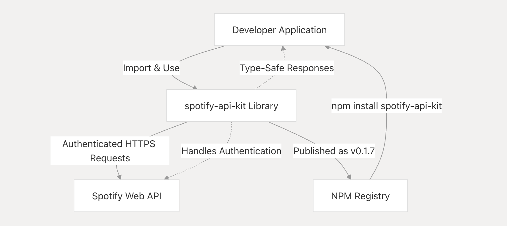
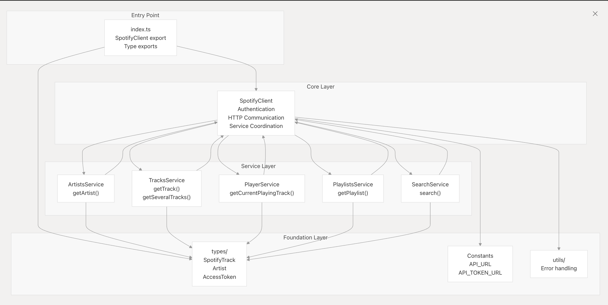

# Spotify API Kit

A modern, type-safe TypeScript wrapper for the Spotify Web API, designed for secure Node.js backend applications.

## Usage

The recommended way to use this library is by calling the SpotifyAPI class, a wrapper around the Spotify Web API. To keep your credentials secure, it interacts with your backend instead of calling Spotify directly from the frontend.

```bash
[Frontend]
   |
   |-> Your wrapper calls your backend (e.g., /api/spotify/search)
              |
              |-> Your backend handles the clientId/clientSecret securely
              |-> Requests an access token from Spotify
              |-> Calls the appropriate Spotify API endpoint
              |-> Returns clean, simplified data back to the frontend
```

## System Context

The spotify-api-kit serves as an intermediary layer between Node.js applications and the Spotify Web API, providing a simplified, type-safe interface for accessing Spotify's music data and services.



## 📦 Installation

```bash
npm install spotify-api-kit # or pnpm, yarn
```

### 🔎 Overview

spotify-api-kit provides an ergonomic, type-safe interface for accessing Spotify’s vast music catalog, managing playback, and performing searches. It handles OAuth 2.0 authentication, token refresh, and HTTP communication, enabling you to focus on building your application logic.

### 📚 Key Features

 • Type Safety: Rich TypeScript types for all Spotify responses.
 • Automatic Authentication: Built-in OAuth2 client credentials flow, token refresh, and caching.
 • Service-Oriented API: Modular classes (ArtistsService, TracksService, PlayerService, etc.).
 • Backend Security: Designed for environments where secrets are kept server-side.
 • Modern Standards: ESM and CommonJS support, Node.js 22+, fully typed.
 • Testing & Linting: Jest, ESLint, Prettier, Biome, and Husky pre-commit hooks.

### 🏗️ Architecture Overview

```typescript
    class SpotifyClient {
        +artists: ArtistsService
        +tracks: TracksService
        +player: PlayerService
        +playlists: PlaylistsService
        +search: SearchService
        +constructor(clientId, clientSecret)
    }
    class ArtistsService {
        +getArtist(id): Promise<Artist>
    }
    class TracksService {
        +getTrack(id): Promise<SpotifyTrack>
        +getSeveralTracks(ids): Promise<SpotifyTrack[]>
    }
    class PlayerService {
        +getCurrentPlayingTrack(): Promise<SpotifyTrack>
    }
    class PlaylistsService {
        +getPlaylist(id): Promise<Playlist>
    }
    class SearchService {
        +search(query, type): Promise<SearchResult>
    }

    // SpotifyClient --> ArtistsService
    // SpotifyClient --> TracksService
    // SpotifyClient --> PlayerService
    // SpotifyClient --> PlaylistsService
    // SpotifyClient --> SearchService
```



⸻

#### 🚀 Getting Started

- Create a Spotify developer application

Go to Spotify Developer Dashboard. Create an app and obtain your `client_id` and `client_secret`

- Initialize the Client

```typescript
import { SpotifyClient } from "spotify-api-kit";

const spotify = new SpotifyClient(
  process.env.SPOTIFY_CLIENT_ID,
  process.env.SPOTIFY_CLIENT_SECRET
);
```

- Search for an Artist

```typescript
const results = await spotify.search.search("Daft Punk", "artist");
console.log(results.artists.items[0].name);
```

- Fetch a Track

```typescript
const track = await spotify.tracks.getTrack("7ouMYWpwJ422jRcDASZB7P");
console.log(track.name, track.artists.map(a => a.name));
console.log(`Track: ${track.name} by ${track.artists.map(a => a.name).join(", ")}`);
```

⸻

#### 🧩 Core Files

Component Purpose Key Files:

- SpotifyClient Central auth & HTTP hub `src/SpotifyClient.ts`

- Service Layer Domain-specific API classes `src/services/`

- Types Spotify API data structures `src/types/`

- Constants API endpoints & config `src/constants/`

- Utils Error handling & helpers `src/utils/`

- Entry Point Package barrel export `src/index.ts`

⸻

##### 🛡️ Development & Quality Standards

- Linting: ESLint (TypeScript), Prettier, Biome
- Testing: Jest with coverage reporting
- Build: TypeScript, tsup for ESM/CJS dual output
- Git Hooks: Husky, lint-staged (pre-commit checks)

```js
// Example scripts in package.json
"scripts": {
  "build": "tsup src/index.ts --dts --format esm,cjs",
  "lint": "eslint . --ext .ts",
  "format": "biome format .",
  "test": "jest --coverage"
}
```

⸻

##### 📖 Further Reading

 • Getting Started
 • API Reference
 • Development Guide
 • Testing

⸻

##### 📝 License

MIT © 2025 Luis Alvarez
This project is licensed under the MIT License. See the [LICENSE](LICENSE) file for details.
This README provides a comprehensive overview of the Spotify API Kit, including installation instructions, usage examples, architecture details, and development standards. It is designed to help developers quickly understand how to integrate and use the library in their Node.js applications while maintaining security and type safety.
